# Quiz-E Retro Gaming Quiz

## Contents

* Introduction
* The Website Design Purpose
* User Story
* Media Queries
* Testing
* Deployment
* Acknowledgements

#

# Introduction

This website was created as the first part of my second Portfolio Project for a Diploma in software development currently undertaken with The Code Institute.
The purpose of the website is to demonstrate my learning and understanding of Javascript.

# The Website Design Purpose

The website has been designed with a retro style look to give a sense of nostalgia to the user. The idea of the quiz is to test the user's knowledge of some of the old time favourite games that were played on the 8Bit computer systems such as the Sinclair Spectrum or Commodore 64. There are a few more modern questions added too to keep up with the times and test whether or not the user is a true gamer.

The website has been designed to enable the user to easily navigate through the pages by using the links within the navbar. The links change dependant on where the user is within the web app. For example there is an option to view the about page when playing the game.

## Homepage Navbar
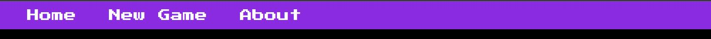
## In Game Navbar

The web app has an about page where the user is able to look at how to use the application. 

## About Page
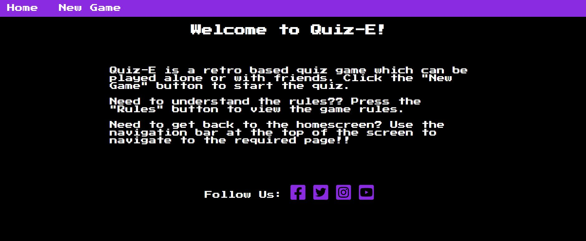

The game screen is where the game is played and replicates an old 8bit computer screen.

##   Game Screen
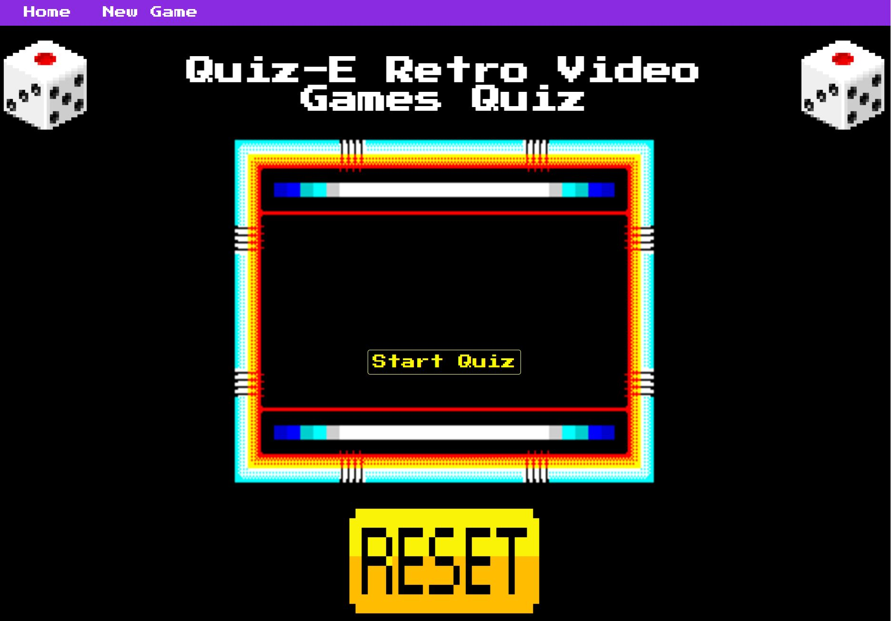

# User Story

As a user I want to be able to use the quiz to test my knowledge of the retro video games that I played on when I was younger. First I am welcomed with an  8 bit pixelated image in the center of the screen along with pixelated logos and retro style font. I am able to click onto the rules button to be offered a pop up style modal message explaining how to navigate through the website along with the purpose of the game and how to play it. After clicking "New Game" I am forwarded to the quiz where I am welcomed with an old school style retro computer screen border which replicates the monitors of the old computer sytem video games. After clicking start the questions appear, giving the user multiple answer questions with the ability to click the answer that I think is correct. Where the correct answer is selected the chosen answer changes color to green and the wrong answers red. Where if I choose a wrong answer I am offered a red colour along with the other wrong answers and the right answer changes to green. This gives me the chance to recognise the correct answer for when I try the quiz again if I don't answer all questions right at the end.  
At the end of the quiz I am able to submit my answers to the computer to then be able to see how many questions that I have answered correct. I am offered a large reset button which resets the game to allow me to try again. 

# Testing

## Testing Javascript

I first tested to ensure that my script was linked into the HTML file correctly by adding an eventListener with a message to the console after a div was clicked. I then used dev tools to look at the console to see if the message had appeared. Once I knew that the JS file was linked I was able to start the code for the quiz.

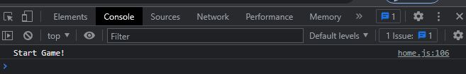

Throughout the process of writing the code for Javascript quiz I tested each function as I wrote them. Where there was an opportunity to add eventListeners I would again use console.log to show a message within the console before adding the required additional functions. 

Where functions wern't working as expected or at all for that matter I would look into the dev tools again to see the message displayed which would point out issues within the code. This sometimes may have been something simple such as missing brackets or curly braces etc. Sometimes a function would be dsplayed but not called for. These messages allowed me to find the issues quickly and amend to suit.

## Testing CSS 

To test that the stylesheet was correctly linked I first added a color to the body of the HTML. By checking that the body had changed colour I knew that the stylesheet was correctly linked.

The CSS was generally tested by using the dev tools and changing the styling using the screen as a preview. Once I was happy with the styling I would copy and paste over to the CSS file.

## Bugs

One of the main bugs that I came across was after deployment of the project to GitHub.
When opening the deployed version in GitHub it was noticed that the CSS wasn't displaying the images. Although an easy fix it was difficult to understand why this was happening.  

## Homepage Bug

## Game Screen Bug
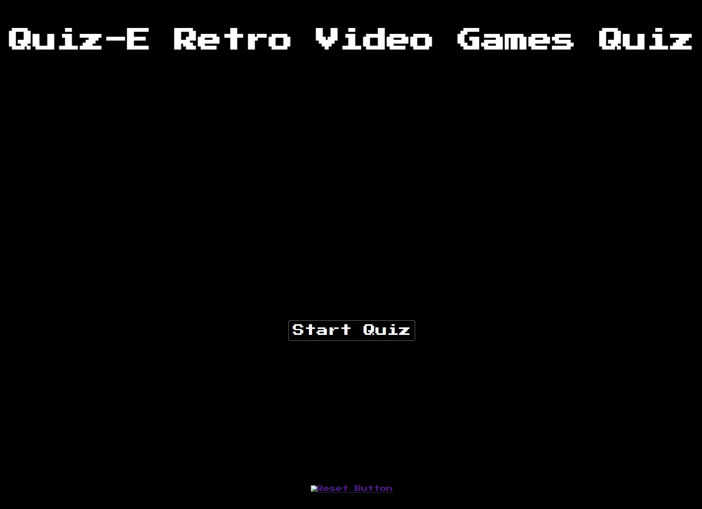

## Bug Fix 

To fix the bug I needed to change the root directory for the images by using dot notation instead of direct path.

## Validation

All of the code has been validated and formatted at the end of the project using W3C Validator and Javascript Formatter

## HTML Validation

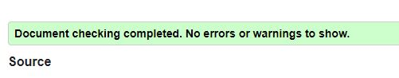

## JS Formatting

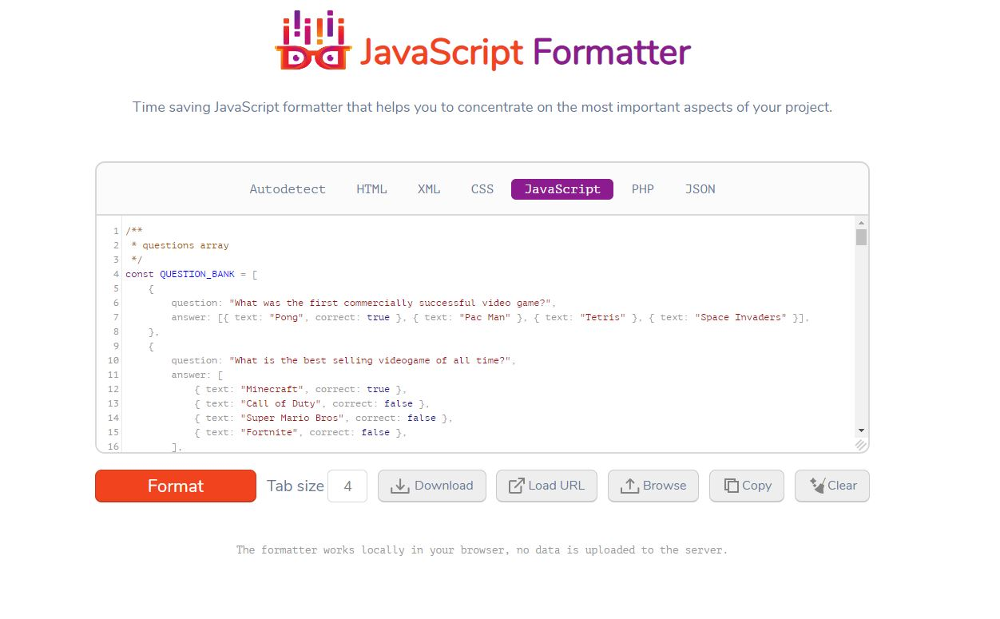

## Media Queries

The page has been designed to be responsive dependant on the screen size that the user chooses.  
I used the dev tools within Google Chrome to test how the media query will work.  
Using Ipad and Iphone as base screen sizes I was able to change the design of the page to suit.  

I changed mainly image sizes and font sizes to accomodate the smaller screens. Due to the design of the pages this was quite a simple process.

## Homepage Mobile

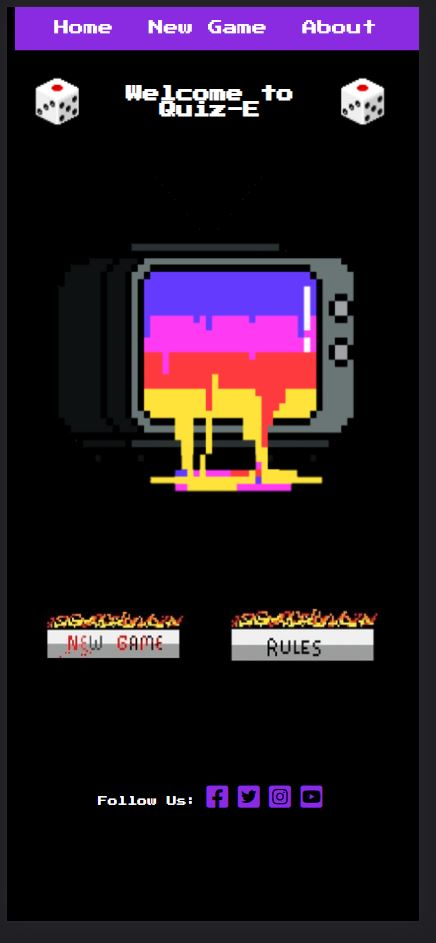

## Homepage Tablet 

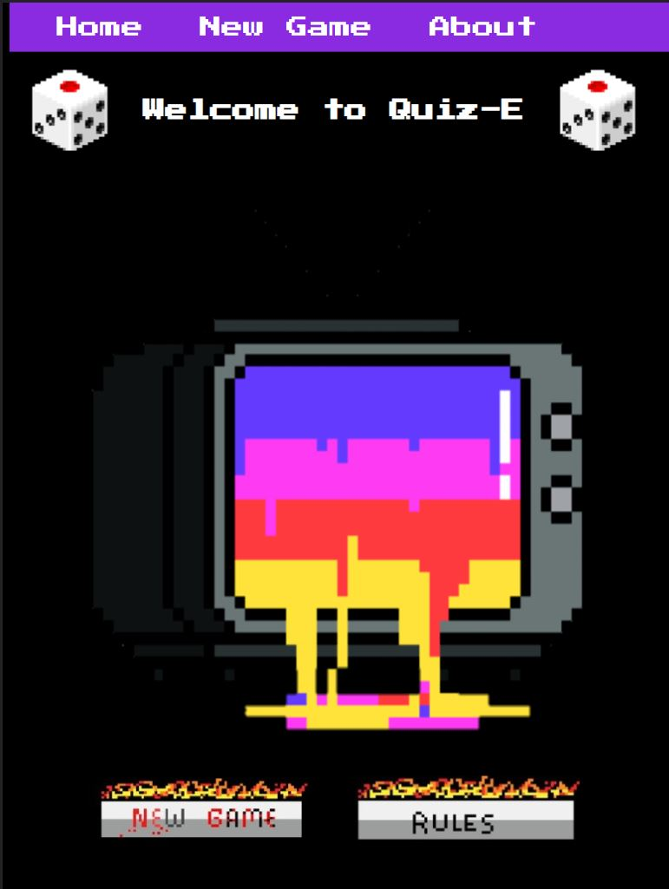

## Game Screen Mobile

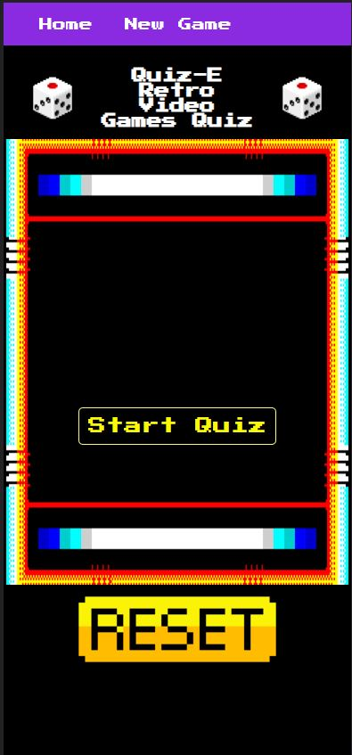

## Game Screen Tablet

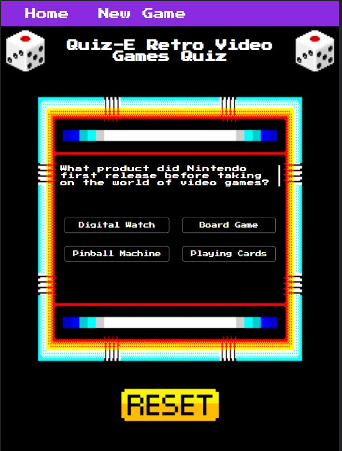

# Deployment

To deploy this project I used Github and gitpod. I first created a repository using the Github terminal. I then cloned the repoository to a folder of which I wanted to store the project. I then added, comitted and pushed all changes to the staging area.
I then deployed to Github by going to settings, pages, select root and saved the file. The project was then branched to github for viewing.

## Acknowledgements

Images courtesy of cleanPNG
Images resized using ImgResizer
Code validation courtesy of W3C.  
JS Code formatting courtesy Javascript Formatter